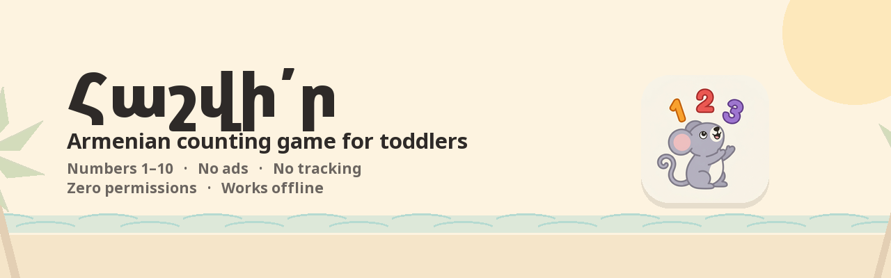

<div align="center">



# Հաշվի՛ր

**An Armenian counting game for toddlers.** Numbers 1–10, spoken in Armenian, on an island.

[](https://github.com/hrach-gevorgyan/hashvir/actions/workflows/release.yml)
[](https://github.com/hrach-gevorgyan/hashvir/releases/latest)
[](#-build)
[](#-build)
[](#-build)

[](#-what-it-does-not-do)
[](#-what-it-does-not-do)
[](#-what-it-does-not-do)
[](#-what-it-does-not-do)
[](#-build)
[](LICENSE)

</div>

---

## 🥥 The story it lives in

**Պույ-պույ Ճստունի** is a mouse from an Armenian children's tale. She finds a coconut, climbs
inside, eats until she is too round to get back out, and cries herself thin enough to escape.

The whole app is set on her beach. Every word the child hears is hers — one voice, one face,
from the greeting to the last number.

---

## 🎮 Four ways to play

<table>
<tr>
<td width="33%" valign="top">

### 🍎 Հաշվել
**Count the fruit**

Tap each one and hear it counted — «մեկ, երկու, երեք…»

Then the fruit gather into one group, Պույ-պույ asks **«Քանի՞ հատ միրգ հաշվեցիր դու»**, and
the child answers out loud *before* the numeral appears.

</td>
<td width="33%" valign="top">

### 🔢 Գուշակել
**Pick the number**

«Ո՞րն է յոթը» — four cards, one right.

Wrong answers stay marked in red so she can see what is already ruled out. Nothing is scored,
nothing is taken away, and she can keep trying.

</td>
<td width="33%" valign="top">

### 🗣️ Սովորել
**Say it out loud**

A number fills the screen and Պույ-պույ asks what it is.

The child says it aloud; the grown-up next to her taps ✓ or ✗. Wrong just means the same
number comes round again.

</td>
</tr>
<tr>
<td width="33%" valign="top">

### 🔢 Հերթով
**In order**

Numbers scattered across the screen, tapped in sequence — 1, then 2, then 3.

Each one says its name and ticks off. After a wrong tap the number she is looking for starts
pulsing, so she is never stuck.

</td>
<td colspan="2" valign="top">

**Cardinality** is *how many there are* — what Հաշվել asks.
**Ordinality** is *what comes next* — what Հերթով asks.

They are different ideas and a child gets them at different times.

</td>
</tr>
</table>

---

## 🧠 What it is actually teaching

Not counting out loud — most three-year-olds can already recite to ten.

What is being built is the mapping between **quantity → numeral → written word → spoken word**,
and above all **cardinality**: knowing that *the last number you say is the answer to how many
there are.*

> A child who counts four apples perfectly and then starts again from one when you ask "how
> many?" has the sequence but not the concept. That gap is the single biggest leap at this age,
> and it is what Հաշվել's question exists for.

---

## 🎨 Design rules

| | |
|---|---|
| 🚫 **No failure states** | No score, no timer, no lives, no losing. A wrong answer gets a soft "not yet" and another go. |
| 🔇 **No text for the child** | Except the Armenian number words, which are part of the lesson. Everything else is voice and picture. |
| 🎯 **Saturated subject, muted ground** | The fruit and numerals are always the most vivid things on screen. The island never competes. |
| 👆 **Large targets** | 126dp minimum — four times the usual adult minimum, because toddlers have gross motor control and little fine motor control. |
| 📱 **Tablets beat phones** | Above six items, a phone cannot fit comfortably tappable targets in the required columns. |

---

## 🔒 What it does **not** do

No internet. No analytics. No crash reporting. No ad SDK. No accounts. No data collection of
any kind. **The manifest declares zero permissions** — there is nothing to grant and nothing to
revoke.

Dependencies are AndroidX and Compose, and nothing else.

---

## 🚧 Not built yet

Honest list, so nobody has to go looking:

- **Parent controls** — no volume, no mute, no way to limit the range to 1–5, and no gate in
  front of the back button.
- **Zero, subitising, and comparing quantities** — the three things I would add next.
- **Phones above six items.** Targets fall to roughly 13–14mm, under what a three-year-old can
  comfortably hit. A tablet fits them properly.

---

## 📦 Install

Grab the APK from [**Releases**](https://github.com/hrach-gevorgyan/hashvir/releases/latest) and
install it on any device running **Android 7.0 or newer**.

A tablet is recommended. See [CHANGELOG.md](CHANGELOG.md) for what is in each version.

---

## 🔨 Build

```bash
./gradlew assembleDebug        # build
./gradlew testDebugUnitTest    # unit tests
./gradlew installDebug         # to a connected device
```

Kotlin · Jetpack Compose · minSdk 24 · single Activity · no navigation library.

Every drawing in the app — the six fruits, Պույ-պույ, the palms, the coconut — is a Compose
vector path. There is not one bitmap in the UI.

<details>
<summary><b>Repository layout</b></summary>

```
app/src/main/java/com/hrach/hashvir/
  game/       round generation, layout maths, view model
  audio/      SoundPool wrapper
  ui/         screens, the mouse, the fruit, the island
  theme/      palette, typography, contrast
tools/        audio normalisation and banner generation
```

Unit tests cover the layout rules and the dp floor on four reference screen sizes, colour
contrast for every fruit against every background, the round generation no-repeat rules, the
choice generator, and the clip list.

</details>

<details>
<summary><b>Audio</b></summary>

43 clips in `app/src/main/res/raw`, one voice throughout, all normalised to −16 LUFS.
[AUDIO.md](AUDIO.md) lists every one with its Armenian text, for anyone re-recording them in
another voice or another language.

```bash
python tools/normalize_audio.py
```

</details>

<details>
<summary><b>Releases</b></summary>

GitHub Actions runs the tests on every push and attaches a signed APK to a Release when a tag
is pushed:

```bash
git tag v0.2.0 && git push origin v0.2.0
```

Signing keys come from repository secrets. Without them the build still succeeds and produces
an unsigned APK.

</details>

---

<div align="center">

Built for one three-year-old, and shared in case it helps anyone else teaching a small child to
count in Armenian.

<sub>MIT licensed — see <a href="LICENSE">LICENSE</a>.<br>
Noto Sans Armenian is used under the SIL Open Font License — see
<a href="licenses/NotoSansArmenian-OFL.txt">licenses/</a>.</sub>

</div>
